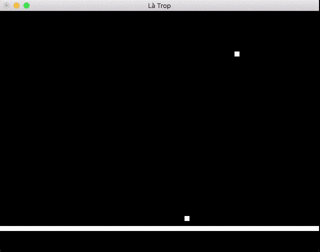

# Lá Trop
## 2D Portal with C++ and GLUT
### Hannah Twigg-Smith, Philip Seger, and Sam Myers

## Big Idea
Là Trop is a two-dimensional, Portal-inspired platformer created in C++ and OpenGL. The player can place two portals which teleport them to the other location on contact. The game world is viewed from the side, and the player is affected by gravity, obstacles, and enemies. They must teleport around to complete levels.

## Background
The main goal of this project was to develop a game in C++ using OpenGL to render sprites and graphics. The finished game consists of player movement from a two-dimensional, side-view perspective. This project was motivated by the team's collective interest in game development and the possibility of learning a new language (C++). Because the goal of this project was to explore the many components of game development, we emphasized this over finalizing a game. Our final project is functional, but not very interesting to a player (we don't have any puzzles to solve). If this project was to continue, we would focus on creating an executable that would be playable from start to finish, but ultimately that was beyond the scope of this project.


### Resources
- [Lighthouse3D Tutorials](http://www.lighthouse3d.com/tutorials/glut-tutorial/) has a large number of OpenGL/GLUT tutorials that were invaluable to us when we were creating our initial environment
- [Learn X in Y minutes](https://learnxinyminutes.com/docs/c++/) was our go-to C++ reference that helped us get started with the language
- [The Simple OpenGL Image Library](http://www.lonesock.net/soil.html) was the library we settled on to assist us with loading images and textures, and the documentation provided some examples on how to do that
- [The OpenGL Documentation](https://www.opengl.org/) was frequently visited as we were trying to understand OpenGL's plethora of functions
- [The Xcode documentation](https://developer.apple.com/reference/) was also useful during our experience with Xcode

We didn't use anything significant aside from these resources, as much of our development process was trial and error. As usual, we als used Google, StackOverflow, and the OpenGL forums to answer many of our questions during development.

## Implementation
We created a scrum-style [sprint plan](https://github.com/hannahtwiggsmith/SoftSysHedonisticHibiscus/projects/1) that can be viewed on GitHub projects. We organized our work using this system instead of Trello because it is fairly new and we wanted to try it out. We separated our work into one-week sprints and created issues for the work we wanted to get done each week, as well as some stretch goals:

**Project goals:**
- ~~Object collision~~ Done!
- ~~User input~~ Done!
- ~~Basic OpenGL rendering~~ Done!
- ~~Model/View/Controller scaffolding~~ Done!
- ~~Reading a level from a text file~~ Done!
- Enemies

**Stretch goals:**
- ~~Textures~~ Done!
- ~~Physics engine (jumping/gravity)~~ Done!
- Portals

We wanted to explore video game development from a lower level instead of using existing frameworks/engines (like Unity or Unreal) to get a better feel for how everything was supposed to work together and to learn more about OpenGL. As such, we decided to use some older technology (specifically GLUT, which was last updated was in 1998). This meant we had to learn about frame redraw and some of the logic behind rendering, as well as polygons and textures, without "cheating" by using a framework that easily rendered objects for us. Much of the knowledge we gained for this we found at [this tutorial](http://www.lighthouse3d.com/tutorials/glut-tutorial/), due to the surprising lack of resources on the internet around this topic. The initial setup of the game environment was quite a challenge using GLUT, but once we had a functioning Model/View/Controller (MVC), it was easy to build off the component parts to complete our goals. The initial physics engine was a contained a lot of "rough" math and we built on it in a similar fashion.

## What was accomplished
We set out to implement some core features that are found in games. Player movement is done with the A and D keys, while jumping is accomplished with W. Q and E fire a portal, and if you already have one Q portal on the map, pressing Q again will replace the position to an updated location next to the player. Levels are stored as .txt files and can be edited by the end user to create custom and unique maps. In these files, 0s represent blank space, while 1s represent a block. The player always starts in the same position, however if they have no ground under them they will fall because of physics. For more in-depth explanation about some of the extra features we worked on, continue reading.

### _OpenGL graphics and textures_
The largest focus for this project was exploring and learning about OpenGL and GLUT, rendering systems that are available for many languages, but in this case more in the context of C++. With GLUT/OpenGL, the main loop takes over the program (using `glutMainLoop()`) and is the reason for frame redraws and updates. This updates the model and renders the view every time it runs through the game loop.

This way of thinking of course caused us some initial trouble. For example, once the glut main loop starts running, printing to std::cout does not work as expected (as the main glut loop never returns). As such, we thought everything was constantly broken because all the debug messages were never showing up. However, once we had a grasp of the `glutMainLoop()`, we were set.

Another component we worked with was SOIL (simple OpenGL image library) in OpenGL. SOIL is much more straightforward than the "pure" OpenGL way of rendering textures, which made our lives considerably easier (~5 lines of code with SOIL vs. ~300 lines without). This meant that we could create a player texture and render it with this code:
```cpp
_tex = SOIL_load_OGL_texture
    (
     "doge.jpg",
     SOIL_LOAD_AUTO,
     SOIL_CREATE_NEW_ID,
     SOIL_FLAG_MIPMAPS | SOIL_FLAG_INVERT_Y | SOIL_FLAG_NTSC_SAFE_RGB | SOIL_FLAG_COMPRESS_TO_DXT
     );
```
This code loads the texture and stores it, which is then rendered onto a polygon with the following code:
```cpp
// Enable 2D textures
glEnable(GL_TEXTURE_2D);

// Bind texture to the texture target (GL_TEXTURE_2D)
glBindTexture(GL_TEXTURE_2D, _tex);

// Create a coord and bind it to the vertex
glBegin(GL_POLYGON);
glColor3f(255,255,255);
glTexCoord2f(0,0);
glVertex2f(_x,_y);
glTexCoord2f(1,0);
glVertex2f(_x+1, _y);
glTexCoord2f(1,1);
glVertex2f(_x+1, _y+1);
glTexCoord2f(0,1);
glVertex2f(_x, _y+1);
glEnd();
```

### _Physics_
Instead of handling player movement as a discrete number of blocks per keypress, we switched to players having acceleration and velocities, making movement seem a little more fluid. The way we process keypresses now sets the velocity of a player, as shown below:
```cpp
void Model::_processKeys() {
    if (_keyStates['a'] && !_keyStates['d']) {
        _player.setActiveVelocity(-PLAYER_SPEED, 0.0f);
    } else if (_keyStates['d'] && !_keyStates['a']) {
        _player.setActiveVelocity(PLAYER_SPEED, 0.0f);
    } else {
        _player.setActiveVelocity(0.0f, 0.0f);
    }
}
```

As well, we process gravity if there is no block underneath the player. This is a meaty function, but the big takeaways are that there is a dy/dt multiplier for gravity, and this affects the player no matter where they are, unless they are on the bottom of the map or intersecting with another block.

```cpp
void Model::_handlePhysics(float dt) {
    float dydt = GRAVITY * (dt / 1000.0f);
    double dx = _player.getVelocity().first * (dt / 1000.0f);
    double dy = (_player.getVelocity().second + dydt) * (dt / 1000.0f);
    Position newPosition = Position(
        _player.getPosition().first + dx,
        _player.getPosition().second + dy
    );

    bool xCollision = false;
    bool yCollision = false;
    for (auto it : _world) {
        int collision = _checkCollision(it.first, newPosition);
        if (collision == 1 && !xCollision) {
            xCollision = true;
            dx += _handleCollision(newPosition.first, it.first.first);
        }
        if (collision == 2 && !yCollision) {
            yCollision = true;
            dy += _handleCollision(newPosition.second, it.first.second);
        }
        if (xCollision && yCollision) {
            break;
        }
    }

    if (yCollision) {
        if (!_player.onGround) {
            _player.onGround = true;
            _player.resetPassiveVelocity();
        }
    } else {
        if (_player.onGround) {
            _player.onGround = false;
        }
        _player.changePassiveVelocity(0.0f, dydt);
    }

    _movePlayer(dx, dy);
}
```

### _Developing in Xcode_
Every member of the team had a Mac and no experience working with Xcode, so we decided to use Xcode as our development environment. We created the entirety of the project in the environment, using the command line as little as possible to fully immerse ourselves. Although we learned quite a bit about linking libraries and managing a large project with Xcode, we have ultimately decided that the trouble it caused us wasn't worth the effort. While it was easy to compile and run the game using the builtin functionality, it also meant that we did not have a way to build for other environments as easily. We also experienced a serious merge conflict within the Xcode project configuration settings at a critical point in implementation that took us multiple hours to resolve. In general, local C++ development with Xcode was fairly straightforward and very nice for building a test package without much extra thought (just use CMD+r), but if we were going to use it again in the future we would better research the intricacies of collborating with it using version control.

### _Exploring C++_
For this project, we switched from C to C++, mainly because we wanted to gain experience with a new language and C++'s object-oriented features are much better suited for game development than pure C. This allowed us to organize our files into the Model-View-Controller structure that is standard for game programming. We used public and private values and functions to more conveniently organize code. 

## The Final Game
The final version of Là Trop can be found in [our git repo](https://github.com/hannahtwiggsmith/SoftSysHedonisticHibiscus). Here's a gif of it running:


