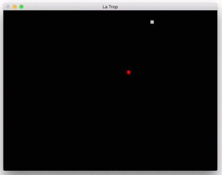

# Project 2 Preliminary Report for Lá Trop
## Hedonistic Hibiscus : Hannah Twigg-Smith, Philip Seger, Sam Myers

## Project Goal
The main goal of this project is to develop a game in C++ using OpenGL to render sprites and graphics. The game consists of player movement from a two-dimensional, top-down perspective. An interesting mechanic we are implementing are portals that will allow the player to teleport to different locations. Stretch goals include adding multiplayer functionality, more advanced graphical animations, and enemies that track down and attack the player.

## Completed Sprint Plan
- We are using GitHub projects instead of Trello. Here are our issues/cards from the first two sprints:
- General model/view/controller scaffolding for the project [#16](https://github.com/hannahtwiggsmith/SoftSysHedonisticHibiscus/issues/16)
- This can be found in the src folder [here](https://github.com/hannahtwiggsmith/SoftSysHedonisticHibiscus/tree/master/src/La%20Trop). The main building blocks are square, player, world, enemy, and model/view/controller.
- Moving objects displayed on screen [#7](https://github.com/hannahtwiggsmith/SoftSysHedonisticHibiscus/issues/7)
- 
- Take user input to move player and exit the game [#15](https://github.com/hannahtwiggsmith/SoftSysHedonisticHibiscus/issues/15)
- The main logic for this can be found [here](https://github.com/hannahtwiggsmith/SoftSysHedonisticHibiscus/blob/master/src/La%20Trop/controller/controller.cpp) in the controller file.
- Understanding of C++ and OpenGL
- Hard to show a concrete example of this, but check out the [code for main](https://github.com/hannahtwiggsmith/SoftSysHedonisticHibiscus/blob/master/src/La%20Trop/main.cpp) or the [whole repo](https://github.com/hannahtwiggsmith/SoftSysHedonisticHibiscus/tree/master/src/La%20Trop)

## Preliminary results
Our team is slightly behind where we want to be at this point. In regards to work done, we currently have a sprite moving from user input (shown in the gif above). Other static blocks are drawn around the moving one. We understand the general concepts of C++ and have done enough research into OpenGL that we have a useful understanding for this project. Our code is also split into Model/View/Controller (a must for most game design) for organization as well as being helpful for collaborative programming.

Moving forward, the bulk of our work will be built on the base we have started in the past two sprints. Starting sprint 3, we plan on holding some “hackathons” (Wednesday and Saturday) to catch up on work and clear out our sprint backlog. More details for Sprint 3 are below.

## Annotated research
Some of the initial research we had on C++ and OpenGL is no longer relevant, however [this website](http://www.lighthouse3d.com/tutorials/glut-tutorial/) has a large number of OpenGL/GLUT tutorials that helped us get started. [Learn X in Y minutes](https://learnxinyminutes.com/docs/c++/) was a great introduction to C++ given our previous knowledge of different programming languages. We will link more resources as we use them.

## Future Sprint Plan
- The cards for this can be found [here](https://github.com/hannahtwiggsmith/SoftSysHedonisticHibiscus/projects/1), and they are also listed below:
- Implement enemies and/or obstacles
- Add textures and sprites
- Object collision/interaction
- Reading levels from a text file and rendering it on screen
- Rendering the screen without flickering on previously drawn blocks
- Player teleportation/movement

## Potential Roadblocks
- OpenGL initially posed some added complexity and confusion, but once we had the basic scaffolding finished those issues were resolved. However, we are using GLUT as our interface library, which could create a roadblock because the last release was in 1998(!). We haven’t had any problems with it yet, but we might switch to FreeGLUT if it becomes an issue. (For example, GLUT takes control of the program and prevents printing to stdout.)
- Every member of the team has a Mac, so we decided to work in XCode in order to add another tool to our belts.
- We have some rendering and redraw issues with GLUT (flickering of sprites) that are currently under investigation. As far as we can tell, this is an aesthetic issue and will not get in the way of game functionality.
- One of our stretch goals is to implement multiplayer, which could add another layer of complexity with networking.
- The learning curve of C++ was minimal, and we have since become much more comfortable with it.
- Ben brought up a good question in class today: How is this project unique for the language? We could write a game like this in practically any language, so we should be considering what special facet of C++ we can take of advantage of during the project. At this point, we don’t know - besides having more control over the hardware with OpenGL. We will continue to think about this in the final sprints and adapt the game as needed.
